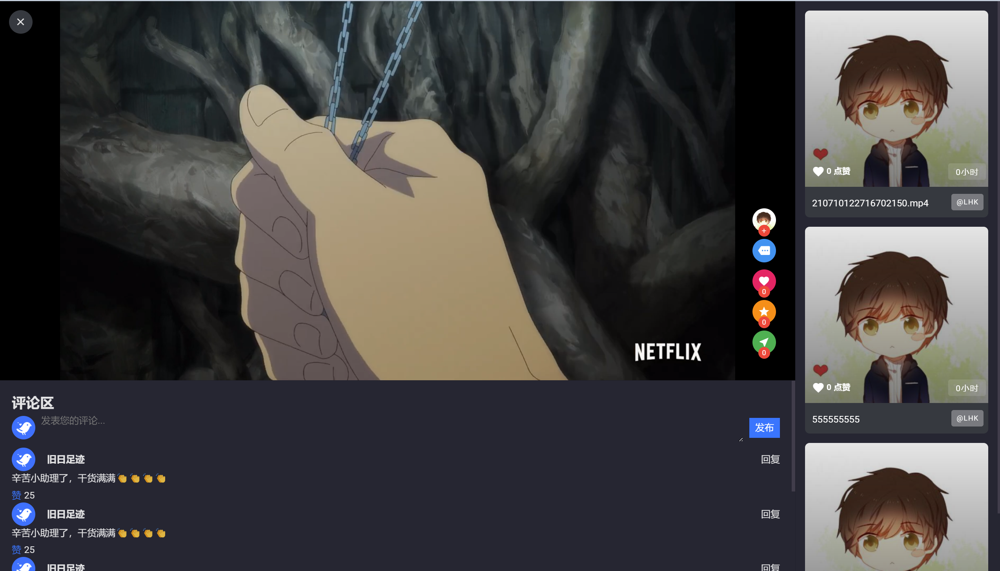

一个短视频单体项目，使用七牛云OSS、CDN等服务。主要包括用户、视频、内容审核、视频推送、评论等模块。

技术栈为：SpringBoot、Mybatis、MySQL、Redis、JWT、Nginx、七牛云、阿里云、ApiFox、Vue、Git、Arthas、Coze

# 目录
[TOC]

## 效果展示：

---

---

---

## 架构

## 功能

### 1 用户
#### 注册
- 生成图形验证码和uuid，并存入redis。key为：前缀+uuid；value为图形验证码。
  uuid用来唯一标识一次注册操作。因为没有用户id不好标识。
- 先检查图形验证码是否过期，再看是否已有邮箱验证码（防刷），然后生成并发送邮箱验证码，并存入reids。key为：前缀+邮箱，value为邮箱验证码
- 校验邮箱验证码通过后再注册用户。
#### 关注/互关
  从库里分别获取用户的粉丝和关注的人，对于是交集的设置each字段代表互关。
#### 浏览记录
- 用户视频浏览记录。不落库，使用zset存储，key为前缀+用户id，value为视频id，score为毫秒数。可以按时间，也可以防重。
- 查看浏览记录时，从reids中取出用户的流量记录，再按天分流，得到返回结果。
#### 搜索记录
  使用zset存储，key为前缀+用户id，value为搜索的内容，score为毫秒数。
  读取时倒序取，这样新的搜索记录就在前面。
### 2 视频
#### 上传
  使用七牛云OSS，采取前端上传的方式。大于 4M 时可分块上传，小于 4M 时直传分块上传时，支持断点续传。
- 前端首先获取上传凭证（后端以接口的方式暴露）
- 前端上传。
- 上传完成后调用后端接口把资源写入数据库。（资源的类型，大小，所有者，key等）
#### 发布
  填充视频基础信息，然后进入视频审核模块
### 3 推送
#### 分类推送
  获取分类下的视频，从redis中取
#### 相似推送
  获取到用户在看的视频的标签，再根据标签进行随机数量（1~5）个视频的获取，同上。
#### 热门推送
  热门视频用按每个月第几天存储在redis中，用set存储。

  热门视频使用定时任务每3小时更新到redis中，热度值大于阈值则放入热门视频中。分批获取所有视频，然后计算热度值。

  热度值计算：
  - 加权和 score：浏览 + 2 * 点赞 + 4 * 收藏 + 8 * 分享 + 16 * 评论
  - 半衰期公式：m=M(1/2)^(t/T)。M是初始质量，T是半衰期，t是衰变时间，m是当前质量
  - 热度 = 半衰期公式（加权和）= score * (1/2)^(t/T)。T假设为3天（毫秒），t即距离发布时间的毫秒数。
    推送时，取出热门视频键中的视频。只取最近三天的，当天推送数量最多（10），前一天3，前两天2.
#### 兴趣推送（用户模型）
  对于未登录的用户，即没有用户模型，会随机选10个标签（先取类别，类别会有初始标签），然后通过redis取出标签下随机数量（1~5）个视频。
  用户模型是一个hash结构，key是前缀+用户id，value是map<标签，得分>。
  用户在视频停留时长/点赞/收藏 将对该视频下的所有标签拿到用户模型中进行增长/缩减。
#### 关注推送
从收件箱里取
#### 热度排行榜
和热门推送类似，也是分批获取所有视频，然后计算热度值。
用一个小根堆（大小为默认10），逐个加入每个视频（封装成HotVideo，主要包括热度和视频title和视频id），最后留下来的就是热度最高的10个，复杂度为O(n log k)。
然后把小根堆里的HotVideo设置到redis里，同时把小于最小score的都删掉（即上一轮的10个）。
### 4 审核
视频发布前，需要进行审核。审核器（链）调用七牛云 API 审核视频、文字、图片，每经过一个审核器，会更新审核信息。

### 5 评论
- 二级评论结构
- 最多显示2条二级评论，其他的点击展开
- Coze bot会 自动回复 关于管理员的评论（如回复管理员发的视频、回复管理员的评论）。如果是询问管理员相关信息，bot会依据预设的信息回复；跟视频有关的评论，根据bot的“想法”回复。